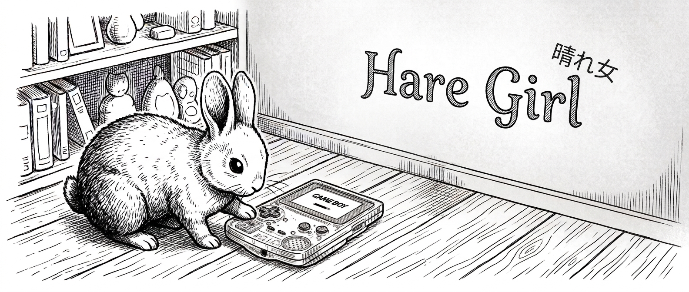

# HareGirl
<p align="center">
  <a href="https://github.com/bubio/haregirl/releases/latest">
    
  </a>
  <a href="https://github.com/bubio/haregirl/blob/main/LICENSE">
    
  </a>
  <a href="https://github.com/bubio/haregirl/actions/workflows/ci.yml">
    
  </a>
  <a href="https://github.com/bubio/haregirl/releases/latest">
    
  </a>
</p>

<p align="center">
  
</p>

Hare言語で書かれた、SDL2をマルチメディア層に利用するGame Boy Colorエミュレーターです。コマンドラインからROMを指定して起動します。

エミュレーションコアは[BubiBoy Lite](https://github.com/bubio/BubiBoyLite)（Odin + SDL2、MIT License）をHareへ移植したものです。


## 現状

実験的な開発中のプロジェクトです。CPU、PPU、APU、タイマー、割り込み、ジョイパッド、シリアル、カートリッジ（MBC1/2/3/5を含む）、DMG/CGB向けの基本的なエミュレーション、バッテリーバックアップRAM、設定ファイル、SDL2による映像・音声出力を実装しています。

互換性やパフォーマンスにはまだ改善の余地があります。市販ゲームのROMを使用する場合は、所有権と各ROMの利用条件を確認してください。


## 対応プラットフォーム

- Ubuntu 22.04以降（amd64 / arm64）
- FreeBSD 14.4以降（x64）

リリース版はGitHub Releasesでzipとして配布します。

## 必要なもの

- [Hare](https://harelang.org/)
- SDL2（実行時ライブラリおよびビルド用ヘッダー）

Ubuntuでは次のように導入できます。

```sh
sudo apt install libsdl2-2.0-0 libsdl2-dev
```

FreeBSDでは次のパッケージを導入します。

```sh
pkg install hare-lang sdl2
```

## ビルド

```sh
git clone https://github.com/bubio/haregirl.git
cd haregirl
./scripts/build.sh
```

実行ファイルは `build/HareGirl` に生成されます。詳細な動作確認は次のコマンドで行えます。

```sh
./scripts/test.sh
```

デバッグ用ビルドは環境変数で切り替えられます。

```sh
HAREGIRL_BUILD_MODE=debug ./scripts/build.sh
```

## 使い方

```text
Usage: HareGirl [--version] [--help] [--test-screen [--frames N]] [--test-audio [--frames N]] [--benchmark --frames N] [--config PATH] [--scale N] [--volume N] [--save-config] [--print-config] [ROM]
```

ROMを起動するには、次のように実行します。

```sh
./build/HareGirl path/to/game.gb
./build/HareGirl path/to/game.gbc
```

主なオプション:

| オプション | 説明 |
|---|---|
| `-h`, `--help` | 使い方を表示して終了 |
| `-v`, `--version` | バージョンを表示して終了 |
| `--scale N` | 画面の表示倍率を指定 |
| `--volume N` | 音量を指定 |
| `--config PATH` | 設定ファイルの場所を指定 |
| `--save-config` | 指定した設定を保存して終了 |
| `--print-config` | 現在の設定を表示して終了 |
| `--benchmark --frames N` | 指定フレーム数をベンチマーク |

ゲーム中の標準キーボード操作は、矢印キー（十字キー）、`Z` / `X`（B / A）、`Enter`（Start）、右`Shift`（Select）、`Esc`（終了）です。

設定ファイルを指定しない場合は、OSの慣習に従ったユーザー設定ディレクトリに保存されます。

## ライセンス

[MIT License](LICENSE)

HareGirlのソースコードにはBubiBoy Lite由来のコードが含まれています。各ゲームのROM、SDL2、Hareのライセンスはそれぞれの著作権者および配布元の条件に従います。
