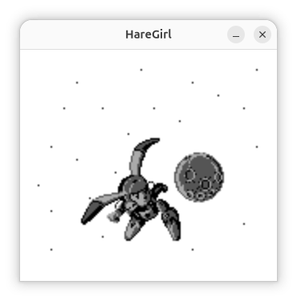
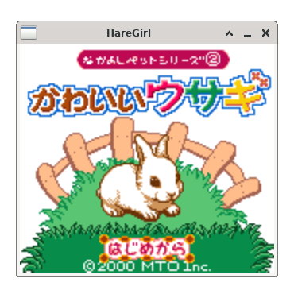

# HareGirl

[日本語](README.ja.md)

<p align="center">
  <a href="https://github.com/bubio/haregirl/releases/latest">
    
  </a>
  <a href="https://github.com/bubio/haregirl/blob/main/LICENSE">
    
  </a>
  <a href="https://github.com/bubio/haregirl/actions/workflows/ci.yml">
    
  </a>
  <a href="https://github.com/bubio/haregirl/releases/latest">
    
  </a>
</p>

<p align="center">
  
</p>

HareGirl is a Game Boy Color emulator written in Hare, using SDL2 as its multimedia layer. Start it from the command line by specifying a ROM.

The emulation core is based on [BubiBoy Lite](https://github.com/bubio/BubiBoyLite) (Odin + SDL2, MIT License), ported to Hare.

## Status

This is an experimental project under active development. It currently implements the CPU, PPU, APU, timer, interrupts, joypad, serial, cartridges (including MBC1/2/3/5), basic DMG/CGB emulation, battery-backed RAM, configuration files, and video/audio output through SDL2.

Compatibility and performance still have room for improvement. If you use commercial game ROMs, verify that you own them and comply with the terms applicable to each ROM.




## Supported platforms

- Ubuntu 22.04 or later (amd64 / arm64)
- FreeBSD 14.4 or later (x64)

GitHub Releases provide zip archives containing native executables for these targets:

| Target | Archive |
|---|---|
| Linux amd64 | `HareGirl-<version>-linux-amd64.zip` |
| Linux arm64 | `HareGirl-<version>-linux-arm64.zip` |
| FreeBSD amd64 | `HareGirl-<version>-freebsd-amd64.zip` |

Each archive contains `HareGirl` and `LICENSE`. The system SDL2 library is required at runtime.

On Ubuntu:

```sh
sudo apt install libsdl2-2.0-0
```

On FreeBSD:

```sh
pkg install sdl2
```

## Building from source

- [Hare](https://harelang.org/)
- SDL2 (runtime library and development headers)

On Ubuntu, install the development headers as well:

```sh
sudo apt install libsdl2-2.0-0 libsdl2-dev
```

On FreeBSD, install the package containing the Hare toolchain:

```sh
pkg install hare-lang sdl2
```

## Build

```sh
git clone https://github.com/bubio/haregirl.git
cd haregirl
./scripts/build.sh
```

The executable is generated at `build/HareGirl`. Run the test suite with:

```sh
./scripts/test.sh
```

Select a debug build with:

```sh
HAREGIRL_BUILD_MODE=debug ./scripts/build.sh
```

## Usage

```text
HareGirl [options] game.gb|game.gbc
```

Run a Game Boy / Game Boy Color ROM:

```sh
./build/HareGirl path/to/game.gb
./build/HareGirl path/to/game.gbc
```

Temporarily change the display scale, volume, and interpolation method from the command line:

```sh
./build/HareGirl --scale 3 --volume 80 --shader smooth path/to/game.gb
```

Save or inspect the current configuration:

```sh
./build/HareGirl --scale 3 --volume 80 --shader smooth --save-config
./build/HareGirl --print-config
```

Launch the test screen or test audio without a ROM. With `--frames N`, the program exits after rendering or playing N frames.

```sh
./build/HareGirl --test-screen --frames 300
./build/HareGirl --test-audio --frames 300
```

Benchmarking requires a ROM and a positive frame count:

```sh
./build/HareGirl --benchmark --frames 3600 path/to/game.gb
```

Options:

| Option | Description |
|---|---|
| `-h`, `--help` | Show usage and exit |
| `-v`, `--version` | Show the version and exit |
| `--test-screen` | Display the test screen |
| `--test-audio` | Play test audio |
| `--benchmark` | Benchmark the specified ROM; requires a ROM and `--frames N` (N > 0) |
| `--frames N` | Exit after N frames during tests, benchmarking, or ROM execution |
| `--config PATH` | Specify the configuration file path |
| `--scale N` | Set the display scale (1–8; default: 4; values above 8 are clamped to 8) |
| `--shader KIND` | Select `nearest` or `smooth` interpolation (default: `nearest`) |
| `--volume N` | Set the volume (0–100; default: 100) |
| `--save-config` | Save the active configuration and exit |
| `--print-config` | Print the active configuration and exit |

The default keyboard controls during gameplay are the arrow keys (D-pad), `Z` (A), `X` (B), `Enter` (Start), right `Shift` (Select), and `Esc` (quit).

The `--help` language follows the runtime locale: Japanese for `ja` locales and English otherwise. `LC_ALL`, `LC_MESSAGES`, and `LANG` are checked in that order.

Unless a configuration path is specified, HareGirl uses `$XDG_CONFIG_HOME/HareGirl/config.ini`, or `$HOME/.config/HareGirl/config.ini` when `XDG_CONFIG_HOME` is unset.

## License

[MIT License](LICENSE)

HareGirl contains code derived from BubiBoy Lite. The ROMs for individual games, SDL2, and Hare are subject to the terms of their respective copyright holders and distributors.
